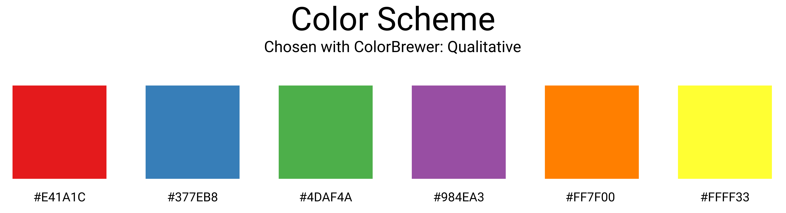
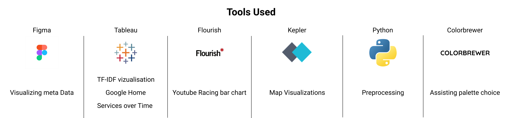
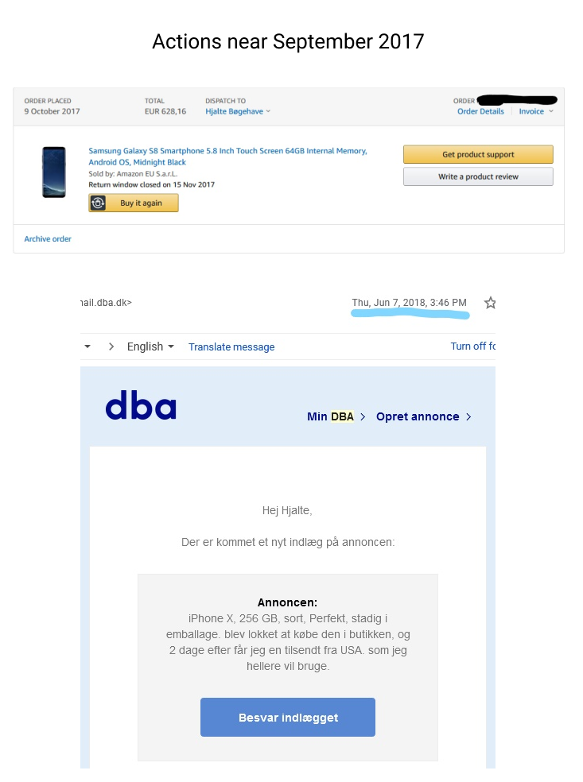

# Introduction

Data Visualization is an extremely powerful tool that enables to convey messages to the reader that are memorable and impactful. As someone who studies Data Science, who gets overly excited about watching a number approach one, i have found it difficult to convey exactly why that is to friends and family, however after converting this endless stream of numbers into a visually pleasing representation, it becomes much more interpretable for the average person.

While this tool can be incredibly valuable to shed some light on difficult topics, it can also easily be abused to convey messages that are favorable for the publisher, either by creating misleading visualizations and thus distracting the consumer from valuable insight, or by creating factually wrong representations of the data. Data Visualizations are often taken at face value by the general public but it is vital to always be skeptical when introduced to a new visualization. In this paper i attempt to keep the transparency as high as possible and with various visualization theories learned from the course in mind.

If any of the visualizations have trouble rendering, links are included in the project PDF.

## Data
The data chosen from this project was my Google data downloaded via Google's Takeout tool. This data included location history, search history, Youtube videos watched, Youtube videos commented, Youtube subscriptions, purchases through the Google store, Google Assistant conversations, amongst others. I do realize this choice of data is a lot more interesting to me than it is to you, but i hope you can still enjoy the visualizations they enabled.

A theme throughout these visualizations is my choice of more visually pleasing visualizations over functionality. This is not to say that the role of functionality in the visualizations was completely omitted, but rather that visual aesthetics was chosen over marginal improvements in functionality. This choice was based upon a desire to create an eye catching story, and it felt appropriate to do so with the dataset at hand, as it's main purpose is to get an objective insight into the data, that is not powered by any agenda. Throughout the paper, I will make sure to either state when these choices are made, or show alternatives for each of them.

A key aspect of the dataset chosen is the temporal aspect that is included. This enables a variety of options where this new dimension can be utilized. I attempt to incorporate this as much as possible, as it is an important aspect of the dataset. 

The data arrived in two formats; either as a JSON or HTML file. Extracting the right data was an iterative process as the formatting for the individual files varied.

### Overview of Logs

Exploring the data, we see the first logs appear on May 2nd 2013 and continue until now. The first noticeable aspect of this graph when plotted is the spike occurring between September 2017 and June 2018. Backtracking to find the root cause, i realized i acquired an android phone in this period of time. As this is not based on "hard evidence" it would not be ideal to use in a professional setting, but given the circumstances, i found it appropriate, and interesting enough to include.

Furthermore splitting the data into types of logging, we see the main source of logging with an android phone was from tracking location. I chose to group the values by month as it seemed like a good balance between functionality and simplicity. Three fields was created so that the data could be further divided into categories, and also filter out the dominating values so the trends in the remaining categories can be observed as well.

> Note: you may have to log into your account associated with the Data Visualization 2020 Tableau Online group.

<iframe src="https://eu-west-1a.online.tableau.com/t/datavisualisationanddatadrivendecisionmakingspring2020/views/Logging_v3/Dashboard2/hjbo@itu.dk/Public?:showAppBanner=false&:display_count=n&:showVizHome=n&:origin=viz_share_link&:embed=yes" width="1000" height="827" frameborder="0"></iframe>

Continuing with the same data, a cumulative sum was created as well to get further insight into the trends of the data. Again, filters can be applied to show a desired category.

<iframe src="https://flo.uri.sh/visualisation/2546372/embed" width="1200" height="900" frameborder="0"></iframe>

### Location History

Given the temporal aspect of the data, various visualizations was made where this extra dimension was utilized. From the location data, a map was visualized to both show general trends in movement, and trends over time. The choice of a simple map was based on keeping the attention on the data, and not to the surroundings. A consequence of this choice is that a certain amount of knowledge about Copenhagen is required to get full value from the visualization, however, based on my knowledge on the target audience of this visualization, it felt like an appropriate choice. 

The desireable usecase for the location data was to implement the visualization as an interactive map. The main advantage being that these visualizations are rarely clouded by the bias of the visualization creator, as the user can freely navigate around and choose to view the data from any desired scope. While this does not ensure the data to be completely transparent, it is a step in the right direction.

<blockquote class="imgur-embed-pub" lang="en" data-id="a/XzlF7jF"></blockquote>

After countless attempts of embedding this album properly, it did not seem to wanna play ball, so i will add this link as an alternative:

<a href="https://imgur.com/a/XzlF7jF">https://imgur.com/a/XzlF7jF</a>

### Youtube

To further explore the trends occurring throughout time, the views for each Youtube channel was visualized through a racing bar chart. This chart type has the advantage of utilizing the extra time dimension, and due to the fast moving pace of the graph, it has potential to attract the attention of the reader compared to other choices. It packs a lot of information, and being interactive, it allows the user to pause and observe the values at any given time. 

<iframe src="https://flo.uri.sh/visualisation/2544074/embed" width="1200" height="900" frameborder="0"></iframe>

 

<iframe src="https://flo.uri.sh/visualisation/2544331/embed" width="1200" height="900" frameborder="0"></iframe>

Besides from this advantage and being visually pleasing (or kinda silly), it can be too distracting for the user to actually gaining a meaningful insight. Since we have data that is constantly moving, and no precise way of choosing a point in time, it becomes difficult to see this deployed in a professional setting. Furthermore, to smooth out the animation, Flourish fills the nan values by interpolating to the next available value, which leads to untruthful representations if the user desires to get exact values pausing on a given timestamp. A more reliable, but certainly not as eye catching, choice would be to either visualize the same data though an interactive dashboard with temporal and filtering options, or create a stacked bar chart.

The remaining data that seemed viable options for creating good visualizations was the Google Assistant data, and the Search History data. 

### Google Assistant

Given the logging of my conversations with Google Assistant, each command was categorized and given a color label respectively, and plotted as a "Packed bubbles" map. Since the data can be further split into categories and packed in a way that is easily perceivable, it provides a nice balance between detail and simplicity. Again, from a purely practical point of view, this would not be the first choice since humans are poor at comparing sizes of circles (and angles). A treemap, or a plain old bar chart would be more practical. 

<iframe src="https://flo.uri.sh/visualisation/2545213/embed" width="1200" height="900" frameborder="0"></iframe>

### Seach Queries

Finally we have the Youtube search history. To filter out stop words, the TF-IDF score was calculated for all words and ranked accordingly. The visualization of choice for this data was the treemap. It provides a good overview of the data and is easier to compare than the packed bubbles presented previously. I chose to visualize the top 50 words for each temporal range, but arguably this could be reduced to reduce clutter, seeing as the values with the lowest TF-iDF scores in the visualization does not have any significant variance associated with them. One visualization decision i could not get to work in flourish, was to use a sequential coloring scheme and adjust the opacity according to the TF-IDF score. This would help amplify the differences between the importance of words. Furthermore, for future improvements, these words could also be categorized and colored accordingly.

<iframe src="https://flo.uri.sh/story/367595/embed" width="1200" height="900" frameborder="0"></iframe>

### Conclusion

Deciding on which ways to visualize the data deemed to be an iterative process. Considering what you are trying to accomplish with the visualizations and what aspects you want to include was reconsidered constantly throughout the project. While the extraction and cleaning of data is vital, the considerations for the data visualizations should be considered to an equal extend. If any conclusion was to be made from the data visualizations, the main realization i made was that i have not utilized my Google Suite very productively.

### Resources

#### Color Scheme

#### Tools

### Appendix

Somehwat questionable proofs of iphone/android switch.

---

